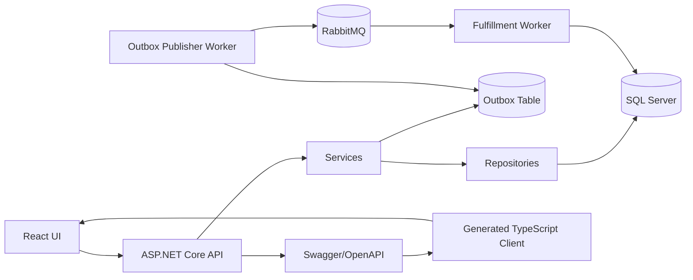
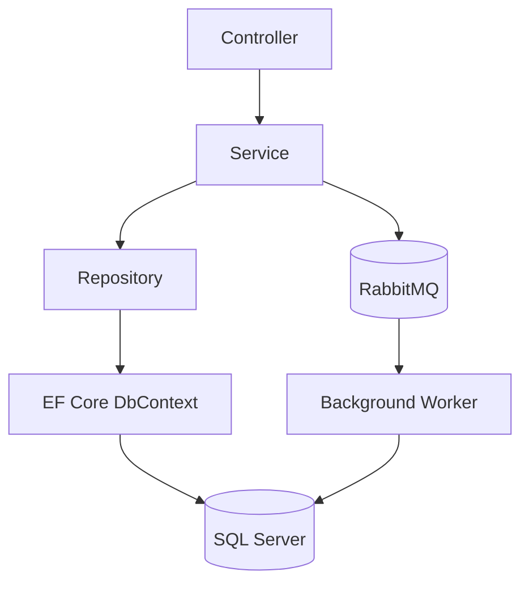
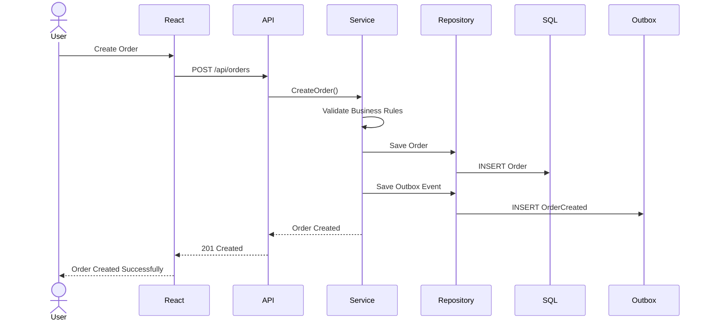
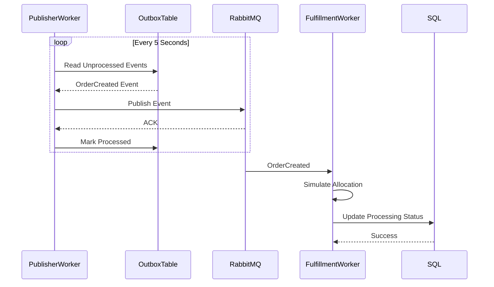
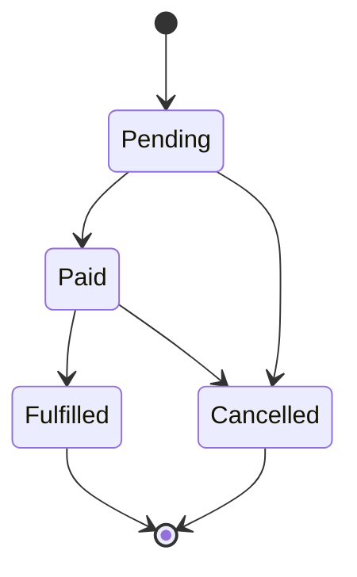
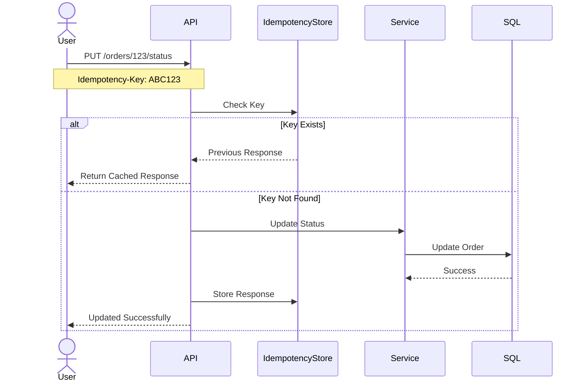
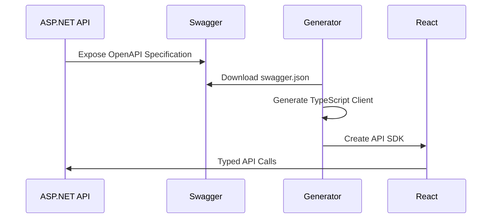

# OrderFlow - Order Management System

A production-ready Order Management System demonstrating clean architecture, event-driven design, messaging reliability, API-first development, and scalable engineering practices.

**Key Documentation**:

- [DEPLOYMENT.md](DEPLOYMENT.md) - Docker Compose and Kubernetes/Helm deployment guide
- [ANSWERS.md](ANSWERS.md) - Technical assessment answers and advanced topics

**Key Features**:

- ✅ REST API with Swagger/OpenAPI documentation
- ✅ **GraphQL endpoint** for flexible querying (`/graphql`)
- ✅ **CI/CD Pipeline** - GitHub Actions with automated build, test, and Docker validation
- ✅ RabbitMQ event-driven messaging with Outbox pattern
- ✅ React + TypeScript frontend
- ✅ Comprehensive testing (unit, integration, E2E)

---

# Overview

This solution was built to demonstrate:

- Clean Architecture principles
- Controller-Service-Repository (CSR) pattern
- Event-driven architecture using RabbitMQ
- Reliable message delivery using the Outbox Pattern
- Idempotent API operations
- EF Core Code First migrations
- OpenAPI-first API development
- Auto-generated TypeScript React client
- Structured logging and observability
- Secure API design
- Testability and maintainability
- SADC regional validation requirements

The goal is not to build a large enterprise system but to demonstrate engineering judgement, maintainability, scalability considerations, and production-ready design patterns.

---

# Architecture Principles

The solution follows the following principles:

- Separation of concerns
- Dependency inversion
- Single responsibility
- API-first development
- Event-driven communication
- Reliable messaging
- Testable business logic
- Strong typing across backend and frontend

---

# High-Level System Architecture



---

# Solution Structure

```text
src/

OrderManagement.Api
│
├── Controllers
├── Middleware
├── Filters
├── Swagger
└── Configuration

OrderManagement.Application
│
├── Services
├── Validators
├── Messaging
├── Mapping
└── Behaviors

OrderManagement.Domain
│
├── Entities
├── Enums
├── Constants
└── BusinessRules

OrderManagement.Infrastructure
│
├── Repositories
├── Persistence
├── RabbitMQ
├── Outbox
├── Migrations
└── Logging

OrderManagement.Contracts
│
├── Requests
├── Responses
├── Events
├── Interfaces
└── Common

OrderManagement.Worker
│
├── Consumers
├── Publishers
└── BackgroundServices

OrderManagement.Web

tests/

OrderManagement.UnitTests

OrderManagement.ApiTests

OrderManagement.IntegrationTests
```

---

# Why a Contracts Project Exists

The Contracts project provides:

- Shared DTOs
- Shared request models
- Shared response models
- Shared RabbitMQ event contracts
- Shared interfaces
- Reusable testing contracts

Benefits:

- No duplicated models
- Strong typing across projects
- Shared event contracts between API and Worker
- Easier integration testing
- Easier end-to-end testing
- Reduced maintenance overhead

Example:

```text
API
  -> Contracts

Worker
  -> Contracts

IntegrationTests
  -> Contracts
```

---

# Controller-Service-Repository Pattern



## Responsibilities

### Controller

Responsible for:

- Request handling
- Response handling
- Swagger documentation
- Model validation
- Logging

Must not contain:

- Business logic
- Database access

---

### Service

Responsible for:

- Business rules
- Validation
- State transitions
- Event creation
- Domain orchestration

Must not contain:

- HTTP concerns
- SQL queries

---

### Repository

Responsible for:

- Database access
- Query execution
- Persistence

Must not contain:

- Business rules

---

# Order Creation Flow



---

# Reliable Messaging - Outbox Pattern

The system uses the Outbox Pattern to guarantee message reliability.

When an order is created:

1. Order is persisted.
2. Event is stored in Outbox table.
3. Transaction commits.
4. Publisher Worker publishes events.
5. Event is marked processed.

This prevents:

- Lost messages
- Partial failures
- Database/event inconsistencies

---

# Outbox + RabbitMQ Flow



---

# Order Lifecycle



## Allowed State Transitions

| Current | Next      |
| ------- | --------- |
| Pending | Paid      |
| Pending | Cancelled |
| Paid    | Fulfilled |
| Paid    | Cancelled |

Any other transition is rejected by the Service layer.

---

# Idempotent Status Updates

The Order Status endpoint supports:

```http
Idempotency-Key: <guid>
```

This prevents duplicate processing caused by:

- Client retries
- Network failures
- Load balancer retries
- Browser refreshes



---

# OpenAPI First Development

The API is fully documented using Swagger/OpenAPI.

Benefits:

- Single source of truth
- Automatic documentation
- Automatic client generation
- Type-safe integration

---

# Generated React Client



Client generation:

```bash
npm run generate:client
```

Example:

```json
{
  "scripts": {
    "generate:client": "openapi-generator-cli generate -i http://localhost:5000/swagger/v1/swagger.json -g typescript-fetch -o ./src/api/generated --skip-validate-spec"
  }
}
```

Frontend never manually creates DTOs.

All API contracts originate from Swagger.

---

# API Endpoints

## REST API (Swagger/OpenAPI)

When running locally with Docker Compose, access the API documentation:

- **Swagger UI**: http://localhost:5063/swagger
- **OpenAPI JSON**: http://localhost:5063/swagger/v1/swagger.json

### Main Endpoints

| Method | Endpoint                      | Purpose                    |
|--------|-------------------------------|----------------------------|
| POST   | `/api/v1/customers`           | Create customer            |
| GET    | `/api/v1/customers`           | Search customers (paginated) |
| GET    | `/api/v1/customers/{id}`      | Get customer details       |
| POST   | `/api/v1/orders`              | Create order with line items |
| GET    | `/api/v1/orders`              | List orders (paginated, filterable) |
| GET    | `/api/v1/orders/{id}`         | Get order details          |
| GET    | `/api/v1/orders/customer/{customerId}` | Get customer's orders |
| PUT    | `/api/v1/orders/{id}/status`  | Update order status (idempotent) |

All endpoints support:
- **Pagination**: `pageSize`, `page` parameters (max pageSize: 100)
- **Filtering**: Status, customer ID, date ranges
- **Sorting**: By date, amount, status
- **Idempotency**: `Idempotency-Key` header for safe retries

## GraphQL Endpoint

Read-only GraphQL API for flexible querying:

- **GraphQL Playground**: http://localhost:5063/graphql (when configured)
- **Schema**: [GraphQL Schema Documentation](server/OrderManagement.Api/GraphQL/schema.graphql)

### Benefits Over REST

| REST                     | GraphQL                        |
|--------------------------|--------------------------------|
| Multiple requests needed | Single request for nested data |
| Over-fetching data       | Request only needed fields     |
| N+1 query problem        | Resolved with DataLoaders      |
| Single client assumption | Multi-client support           |

### GraphQL Query Examples

```graphql
query GetOrdersWithLineItems {
  orders(customerId: "12345678-1234-1234-1234-123456789012") {
    id
    totalAmount
    status
    lineItems {
      productSku
      quantity
      lineTotal
    }
    customer {
      name
      email
    }
  }
}

query GetCustomerWithOrders {
  customer(id: "12345678-1234-1234-1234-123456789012") {
    id
    name
    email
    orders {
      id
      totalAmount
      status
    }
  }
}
```

---

# Database Design

## Core Entities

### Customer

```text
Id
Name
Email
CountryCode
CreatedAt
```

### Order

```text
Id
CustomerId
Status
CurrencyCode
TotalAmount
CreatedAt
RowVersion
```

### OrderLineItem

```text
Id
OrderId
ProductSku
Quantity
UnitPrice
```

### OutboxMessage

```text
Id
EventType
Payload
Processed
CreatedAt
```

---

# Optimistic Concurrency

Orders use RowVersion concurrency control.

```csharp
[Timestamp]
public byte[] RowVersion { get; set; }
```

Benefits:

- Prevents lost updates
- Handles concurrent modifications safely
- Supports optimistic concurrency

---

# EF Core Migration Strategy

Example migration history:

```bash
dotnet ef migrations add InitialCreate

dotnet ef migrations add AddOrderRowVersion

dotnet ef migrations add AddOutbox

dotnet ef database update
```

Generate deployment script:

```bash
dotnet ef migrations script -o migrations.sql
```

---

# Zero Downtime Deployment Strategy

Expand → Migrate → Contract

1. Add new structures
2. Deploy new code
3. Migrate traffic
4. Remove deprecated structures

This minimizes deployment risk.

---

# Security

Authentication strategy:

- JWT Bearer Tokens
- Microsoft Entra ID compatible

Authorization strategy:

- Role-based authorization
- Policy-based authorization

Additional protections:

- Input validation
- Idempotency keys
- Optimistic concurrency
- Structured audit logging
- Correlation IDs

Future enhancements:

- Azure Key Vault
- Rate limiting
- Secrets rotation
- Managed identities

---

# SADC Regional Validation

The solution validates:

- ISO 3166-1 Alpha-2 country codes
- ISO 4217 currency codes

Examples:

| Country | Currency |
| ------- | -------- |
| ZA      | ZAR      |
| BW      | BWP      |
| NA      | NAD      |
| LS      | LSL      |
| SZ      | SZL      |
| ZW      | USD      |
| ZW      | ZWL      |

---

# Common Monetary Area (CMA)

Special consideration is given to:

```text
ZAR
NAD
LSL
SZL
```

Validation rules support these regional relationships.

---

# Observability

## Structured Logging

Implemented using:

- Serilog

Logs include:

- CorrelationId
- RequestId
- OrderId
- CustomerId

---

## Metrics

Tracked metrics:

```text
orders_created_total

orders_processed_total

api_request_duration

rabbitmq_publish_duration

rabbitmq_processing_duration
```

---

## Distributed Tracing

Implemented using:

- OpenTelemetry

Trace flow:

```text
API
  ↓
Outbox
  ↓
RabbitMQ
  ↓
Worker
```

---

# Testing Strategy

## Unit Tests

Coverage includes:

- Order calculations
- Status transitions
- Currency validation
- Idempotency validation

---

## API Tests

Coverage includes:

- Create customer
- Search customers
- Create order
- Retrieve order
- Update status

---

## Integration Tests

Coverage includes:

- EF Core persistence
- RabbitMQ publishing
- Outbox processing
- End-to-end workflows

---

## Test Pyramid

```text
            E2E
             ▲
             │
      Integration
             ▲
             │
          Unit
```

---

# Docker Environment

Services:

```text
sqlserver

rabbitmq

api

worker

web
```

Start everything:

```bash
docker-compose up -d
```

For detailed deployment instructions including Docker Compose and Kubernetes with Helm, see [DEPLOYMENT.md](DEPLOYMENT.md).

---

# Technology Stack

## Backend

- ASP.NET Core 8
- Entity Framework Core
- SQL Server
- RabbitMQ
- Swagger/OpenAPI
- Serilog
- OpenTelemetry
- xUnit

## Frontend

- React
- TypeScript
- React Query
- Generated OpenAPI Client

## Infrastructure

- Docker Compose
- SQL Server
- RabbitMQ

---

# Tradeoffs & Assumptions

- Microsoft Entra integration is mocked for assessment purposes.
- FX conversion is not implemented unless selected as an enhancement.
- RabbitMQ is used to demonstrate asynchronous processing and messaging patterns.
- Outbox Pattern is implemented to ensure message reliability.
- React UI prioritizes functionality and type safety over styling.
- Architecture favors maintainability and testability over premature optimization.

---

# CI/CD Pipeline

Automated build, test, and deployment using GitHub Actions:

**File**: [.github/workflows/ci.yml](.github/workflows/ci.yml)

## Pipeline Stages

1. **Build & Test** (build-test job)
   - Restore .NET dependencies
   - Build backend solution
   - Run backend unit and integration tests
   - Install npm dependencies
   - Build React frontend
   - Run frontend tests
   - Code formatting validation

2. **Docker Validation** (docker-build job)
   - Build Docker Compose stack
   - Validate service health:
     - API health check: `http://localhost:5063/swagger`
     - Client health check: `http://localhost:3000`
   - Services integration test

3. **Notifications** (notify job)
   - Aggregate build status
   - Report pass/fail results

## Service Dependencies

The pipeline includes service dependencies for integration testing:

- **SQL Server 2022** - Port 1433
- **RabbitMQ 3.13** - Port 5672

## Artifacts

Successfully built artifacts are uploaded for deployment:

- Backend NuGet packages
- Frontend build dist/
- Docker images

Run locally:

```bash
docker-compose up -d
# Run tests: npm test (frontend) / dotnet test (backend)
```

---

# Assessment Objectives Demonstrated

| Category                          | Demonstrated |
| --------------------------------- | ------------ |
| Architecture & Code Quality       | ✅           |
| Backend Implementation            | ✅           |
| EF Core Migrations & DB Lifecycle | ✅           |
| API Design & Documentation        | ✅           |
| Security                          | ✅           |
| Messaging & Resilience            | ✅           |
| Frontend                          | ✅           |
| Testing                           | ✅           |
| Observability                     | ✅           |
| Performance Awareness             | ✅           |
| DevOps                            | ✅           |

This solution prioritizes correctness, maintainability, resilience, and clarity while demonstrating senior-level engineering practices.
